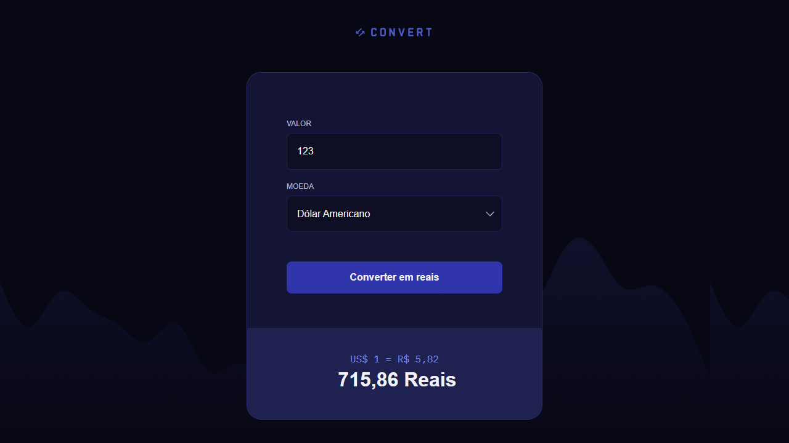
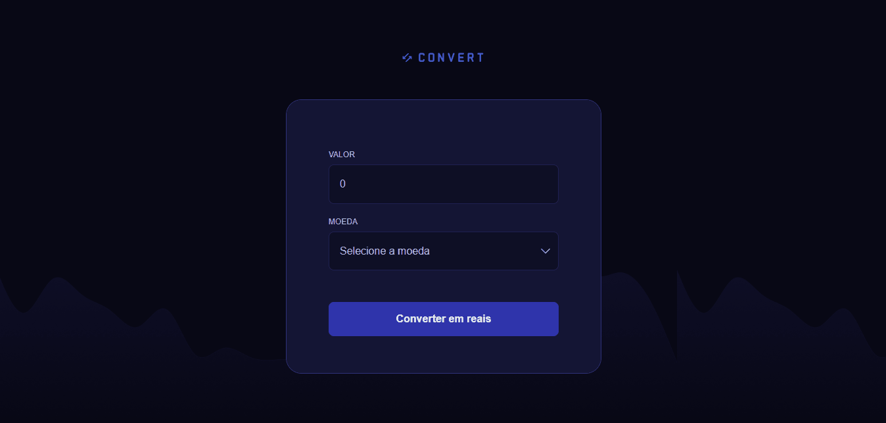

<h1 align="center">
  
</h1>

<div align="center">
  <a href="#📸-visão-do-projeto--project-view">📸 Visão do Projeto | Project View</a> -
  <a href="#ℹ-sobre-o-projeto--about-the-project">ℹ Sobre o Projeto | About the Project</a> -
  <a href="#🏗-principais-funcionalidades--main-features">🏗 Principais Funcionalidades | Main Features</a> -
  <a href="#⚙️-tecnologias--technologies">⚙️ Tecnologias | Technologies</a> -
  <a href="#🧪-testar-o-projeto---clique-no-botão--test-the-project---click-on-the-button">🧪 Testar o Projeto - Clique no botão | Test the Project - Click on the button</a> -
  <a href="#🎨-template---clique-na-miniatura--template---click-on-the-thumbnail">🎨 Template - Clique na miniatura | Template - Click on the thumbnail</a> -
  <a href="#💻-clonagem-do-repositório--repository-cloning">💻 Clonagem do Repositório | Repository Cloning</a> -
  <a href="#🤝-contribuições--contributions">🤝 Contribuições | Contributions</a> -
  <a href="#👨‍💻-autor--author">👨‍💻 Autor | Author</a>
</div>

## 📸 Visão do Projeto | Project View

<div align="center">
  
  

</div>

## ℹ Sobre o Projeto | About the Project

### 🌐 Português

Durante meus estudos em desenvolvimento web, desenvolvi um projeto simples de conversor de moedas utilizando JavaScript. Recebi um layout pronto, com HTML e CSS já definidos, e minha responsabilidade foi implementar toda a lógica da aplicação. A proposta era permitir que o usuário digitasse um valor, escolhesse entre dólar, euro ou libra, e visualizasse a conversão para reais com base em taxas de câmbio fixas.

O principal desafio foi garantir uma interação fluida e segura, validando os dados inseridos, tratando possíveis erros e exibindo o resultado de forma clara e formatada. Usei manipulação de DOM para atualizar dinamicamente os elementos da interface e eventos para controlar o comportamento do formulário, mantendo o código limpo, modular e fácil de entender.

O resultado foi uma aplicação funcional, intuitiva e estável, com foco na experiência do usuário. Esse projeto foi essencial para reforçar meu domínio de JavaScript puro, além de me dar mais confiança para integrar lógica a interfaces existentes com responsabilidade, clareza e atenção aos detalhes.

### 🌐 English

During my web development studies, I created a simple currency converter project using JavaScript. I received a pre-built layout with HTML and CSS already defined, and my responsibility was to implement the entire application logic. The goal was to allow the user to input an amount, choose between dollars, euros, or pounds, and view the conversion to Brazilian reais based on fixed exchange rates.

The main challenge was ensuring a smooth and secure interaction, validating the entered data, handling potential errors, and displaying the result in a clear and formatted way. I used DOM manipulation to dynamically update the interface elements and events to control the form behavior, keeping the code clean, modular, and easy to understand.

The result was a functional, intuitive, and stable application, with a focus on user experience. This project was crucial for reinforcing my proficiency in pure JavaScript, and it also gave me more confidence in integrating logic into existing interfaces with responsibility, clarity, and attention to detail.

## 🏗 Principais Funcionalidades | Main Features

### 🌐 Português

- [x] **Validação de entrada de dados:** Impede que o usuário digite caracteres inválidos no campo de valor, aceitando apenas números para garantir uma conversão correta.

- [x] **Seleção de moeda estrangeira:** Oferece ao usuário a escolha entre Dólar Americano (USD), Euro (EUR) e Libra Esterlina (GBP) para realizar a conversão.

- [x] **Conversão automática para reais:** Calcula o valor em reais com base na moeda selecionada e exibe o resultado com base em taxas de câmbio fixas.

- [x] **Exibição dinâmica do resultado:** Mostra o valor convertido em tempo real com formatação monetária brasileira (R$), além da taxa de câmbio utilizada.

- [x] **Atualização do conteúdo com manipulação de DOM:** Controla a visibilidade dos elementos da interface de forma dinâmica, melhorando a experiência do usuário.

- [x] **Tratamento de erros:** Garante estabilidade na aplicação exibindo uma mensagem amigável caso ocorra algum erro inesperado durante a conversão.

### 🌐 English

- [x] **Input validation:** Prevents the user from entering invalid characters in the amount field, accepting only numbers to ensure accurate conversion.

- [x] **Foreign currency selection:** Allows the user to choose between US Dollar (USD), Euro (EUR), and British Pound (GBP) for the conversion.

- [x] **Automatic conversion to Brazilian Real:** Calculates the amount in reais based on the selected currency and displays the result using fixed exchange rates.

- [x] **Dynamic result display:** Shows the converted value in real time with Brazilian currency formatting (R$), along with the exchange rate used.

- [x] **DOM manipulation to update content:** Dynamically controls the visibility of interface elements, enhancing the user experience.

- [x] **Error handling:** Ensures application stability by displaying a user-friendly message in case of any unexpected errors during the conversion.

## ⚙️ Tecnologias | Technologies

- <a href="https://www.w3schools.com/html/default.asp"> HTML</a>
- <a href="https://www.w3schools.com/css/"> CSS</a>

## 🧪 Testar o Projeto - Clique no botão | Test the Project - Click on the button

<a href="https://henry-frrz.github.io/convert/">
  
</a>

## 🎨 Template - Clique na miniatura | Template - Click on the thumbnail

<a align="center" href="https://github.com/rocketseat-education/convert-template">
  
</a>

## 💻 Clonagem do Repositório | Repository Cloning

### 🌐 Português

1. **Requisitos:** Você precisa apenas de um navegador para executar este projeto.

2. **Baixar o Projeto:** Clique no botão **Code** e selecione **Download ZIP**, depois extraia os arquivos no local desejado. Alternativamente, você pode clonar o repositório usando Git:

```bash
git clone https://github.com/henry-frrz/convert.git
```

3. **Abrir o Projeto:** Localize os arquivos extraídos ou clonados e abra o arquivo `index.html` no seu navegador.

### 🌐 English

1. **Requirements:** You only need a web browser to run this project.

2. **Download the Project:** Click on the **Code** button and select **Download ZIP**, then extract the files to your preferred location. Alternatively, you can clone the repository using Git:

```bash
git clone https://github.com/henry-frrz/convert.git
```

3. **Open the Project:** Locate the extracted or cloned files and open the index.html file in your browser.

## 🤝 Contribuições | Contributions

### 🌐 Português

Se você deseja contribuir para o projeto, siga as diretrizes abaixo:

1. Faça um fork do repositório no GitHub.

2. Crie uma nova branch para sua contribuição:

```bash
git checkout -b feature/sua-contribuicao
```

3. Faça as alterações necessárias e teste para garantir que as mudanças sejam robustas e confiáveis.

4. Envie suas alterações com um pull request (PR).

5. Após revisão e aprovação, suas alterações serão incorporadas ao projeto.

### 🌐 English

If you would like to contribute to the project, please follow the contribution guidelines below:

1. Fork the repository on GitHub.

2. Create a new branch for your contribution:

```bash
git checkout -b feature/your-contribution
```

3. Make any necessary changes, and test them to ensure that the changes are robust and reliable.

4. Submit your changes with a pull request (PR).

5. After review and approval, your changes will be incorporated into the project.

## 👨‍💻 Autor | Author

<a href="https://github.com/henry-frrz">

</a>
<br>
